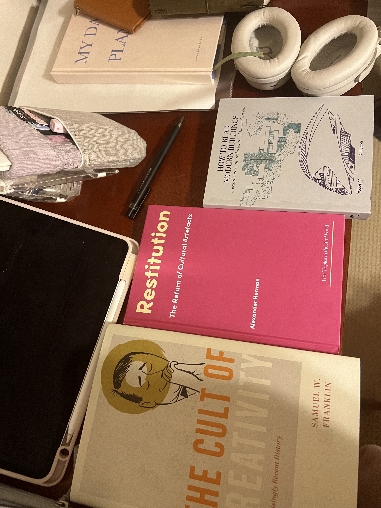

```{=html}
<div class="art-page">

  <!-- ═══ Hero image — museum atrium ═══ -->
  <div class="art-hero-image">
    
    <div class="art-hero-overlay">
      <p class="art-hero-text">Where objects breathe<br>and spaces remember</p>
    </div>
  </div>

  <!-- ═══ Opening statement ═══ -->
  <div class="art-statement">
    <div class="art-divider">
      <span class="art-divider-diamond"></span>
    </div>
    <p>
      Before I found my path in analytics, I fell in love with museums — the way
      a single artifact can collapse centuries into a moment of understanding.
      My graduate work at the <strong>University of Pennsylvania</strong> in
      <em>Media, Heritage, and Integrated Product Design</em> taught me to see
      design as a bridge between past and present, between the object and the visitor,
      between data and human experience.
    </p>
  </div>

  <!-- ═══ Split: portrait + manifesto ═══ -->
  <div class="art-split">
    <div class="art-split-image">
      <div class="art-frame">
        
      </div>
      <span class="art-caption">At the garden labyrinth — where landscape becomes language</span>
    </div>
    <div class="art-split-text">
      <h2 class="art-section-label">The Artist's Eye</h2>
      <p>
        I believe the best design disappears. It doesn't announce itself —
        it makes you <em>feel</em> something before you understand why.
        A spiral hedge is not just topiary; it is a meditation on patience.
        A suspended sculpture is not decoration; it is gravity, reimagined.
      </p>
      <p>
        This is what I carry into every project: the instinct that beauty
        and rigor are not opposites — they are collaborators.
      </p>
    </div>
  </div>

  <!-- ═══ Reading desk — full bleed ═══ -->
  <div class="art-reading">
    <div class="art-reading-content">
      <h2 class="art-section-label">The Reading Table</h2>
      <p class="art-reading-intro">
        Every practice begins with inquiry. These are the texts that shape
        how I think about cultural ownership, architectural language,
        and the politics of preservation.
      </p>
    </div>
    <div class="art-reading-image">
      <div class="art-frame-wide">
        
      </div>
      <div class="art-book-tags">
        <span class="art-tag">Restitution: The Return of Cultural Artifacts</span>
        <span class="art-tag">How to Read Modern Buildings</span>
        <span class="art-tag">The Cult of Creativity</span>
      </div>
    </div>
  </div>

  <!-- ═══ Pillars ═══ -->
  <div class="art-pillars">
    <h2 class="art-section-label">What Guides This Work</h2>
    <div class="art-pillar-grid">
      <div class="art-pillar">
        <div class="art-pillar-number">01</div>
        <h4>Cultural Narrative</h4>
        <p>Every exhibition begins with a question: <em>whose story is being told, and for whom?</em> I design experiences that honor the complexity of heritage.</p>
      </div>
      <div class="art-pillar">
        <div class="art-pillar-number">02</div>
        <h4>Material & Memory</h4>
        <p>Objects are not static — they carry the weight of the hands that made them, the journeys they've traveled, and the meanings communities have given them.</p>
      </div>
      <div class="art-pillar">
        <div class="art-pillar-number">03</div>
        <h4>Spatial Storytelling</h4>
        <p>The gallery is a language. Light, distance, sequence, and silence — each element shapes how a visitor moves through understanding.</p>
      </div>
    </div>
  </div>

  <!-- ═══ Featured project ═══ -->
  <div class="art-featured">
    <div class="art-featured-frame">
      <div class="art-featured-inner" style="background-image: url('project o.JPG');">
        <span class="art-featured-label">Featured Collection</span>
        <h3 class="art-featured-title">Project Overview Portfolio</h3>
        <p class="art-featured-desc">
          A curated portfolio of heritage design work exploring museum exhibition
          concepts, cultural artifact interpretation, and integrated product design
          — developed during my graduate studies at UPenn's Weitzman School of Design.
        </p>
        <div class="art-featured-details">
          <div class="art-detail">
            <span class="art-detail-label">Institution</span>
            <span class="art-detail-value">University of Pennsylvania</span>
          </div>
          <div class="art-detail">
            <span class="art-detail-label">Program</span>
            <span class="art-detail-value">Media, Heritage & Integrated Product Design</span>
          </div>
          <div class="art-detail">
            <span class="art-detail-label">Year</span>
            <span class="art-detail-value">Spring 2024</span>
          </div>
        </div>
        <a href="https://yafeiz.wixsite.com/yafei-zhang" target="_blank" class="art-view-btn">
          <span>View Full Collection</span>
          <svg xmlns="http://www.w3.org/2000/svg" width="16" height="16" viewBox="0 0 24 24" fill="none" stroke="currentColor" stroke-width="1.5" stroke-linecap="round" stroke-linejoin="round"><path d="M7 17l9.2-9.2M17 17V7H7"/></svg>
        </a>
      </div>
    </div>
  </div>

  <!-- ═══ Closing — Pullquote ═══ -->
  <div class="art-pullquote">
    <div class="art-pullquote-inner">
      <span class="art-pullquote-mark">&ldquo;</span>
      <p class="art-pullquote-text">This work shaped how I see data today — not as numbers on a screen, but as <em>stories waiting for the right frame.</em></p>
      <p class="art-pullquote-text art-pullquote-second">
        Heritage taught me that context is everything.<br>
        <strong>Analytics lets me prove it.</strong>
      </p>
      <div class="art-pullquote-line"></div>
    </div>
  </div>

</div>
```
