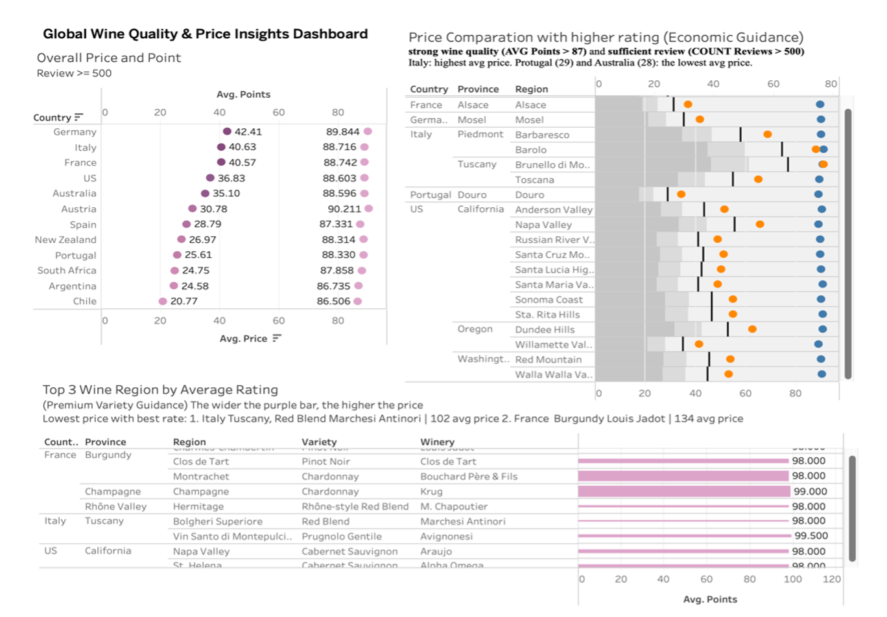
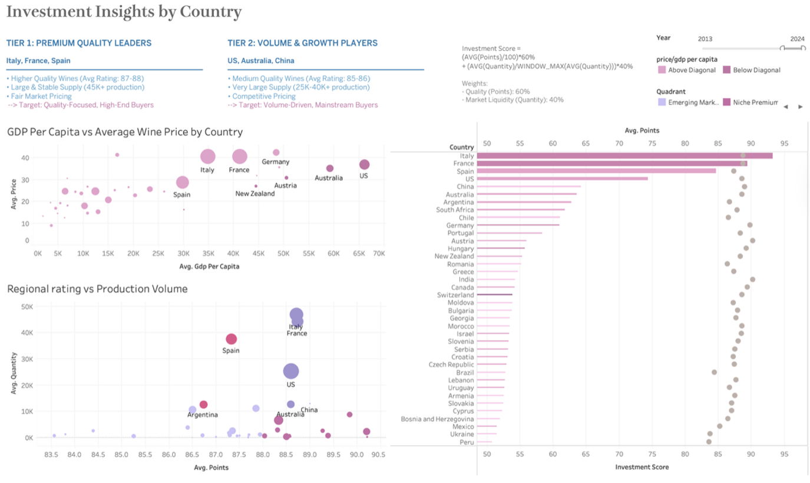
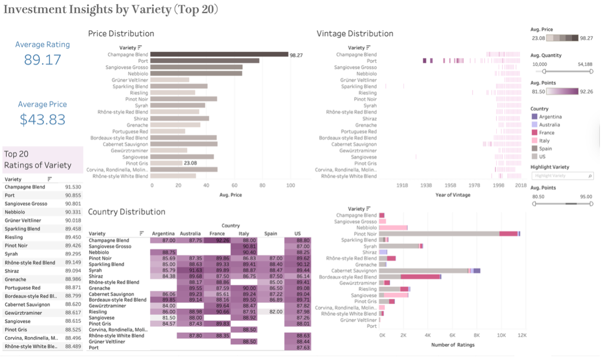

## Problem

Decision-makers needed a data-driven way to balance wine quality, pricing, production scale, and economic context when allocating sourcing and investment portfolios.

## Approach

Designed a **multi-dashboard analytics system** integrating:

- **130K+ wine reviews**
- Global **GDP per capita** data
- Wine **production & consumption** statistics

{fig-alt="Dashboard showing overall price and point analysis by country, price comparison with higher rating, and top wine regions by average rating"}

## Key Insights

Identified a **two-tier sourcing strategy**:

| Tier | Countries | Rationale |
|---|---|---|
| **Tier 1** | France, Italy, Spain | High quality + high production stability |
| **Tier 2** | US, Australia, China | Scalable volume with competitive quality |

{fig-alt="Dashboard showing tier classification, GDP vs wine price scatter plot, and regional rating vs production volume analysis"}

Additional findings:

- Revealed **underpriced high-quality markets** using price-rating analysis
- Highlighted wine varieties offering **premium quality at lower cost**

{fig-alt="Dashboard showing price distribution, vintage distribution, country distribution, and top 20 variety ratings"}

## Impact

- Enables **data-driven sourcing**, pricing, and portfolio optimization decisions
- Supports both **premium positioning** and high-volume growth strategies

## Tools & Skills

`Tableau` · `Python (Polars)` · `SQL-style Joins` · `Data Cleaning` · `Investment Scoring Models` · `Business Intelligence`
